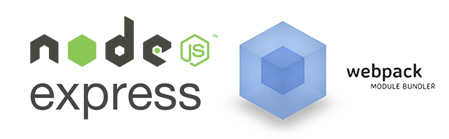

# *Lollipop!*
*Query the League of Legends API via a local express api server. Builds a static front-end app using webpack.*

-----------------
### Dev Setup
1. Clone the repo: ``git clone https://github.com/pstrawberriedev/lollipop.git && cd lollipop``
2. Install dependencies: ``npm install``
3. Rename ``src/api/_secret.js`` to ``secret.js``
4. Add your API key to the newly-renamed ``src/api/secret.js``
5. Start the dev server: ``npm start``

### Styling
- Lollipop uses LESS as its css pre-processor (handled by webpack)
- Styles are controlled via ``/src/client/styles/styles.less``
- Lollipop's aim is to be fully themeable, so all color styling is done in ``src/client/styles/app/themes.less``
  - ``<body class="theme-default">`` a body class sets up the theme - the default theme is called "default"

### API Limits
- Out of the box, your Riot API Key is a "developer key"
  - 10 calls per 10 seconds
  - 500 calls per 10 minutes
- Lollipop currently makes 8 total calls to get the following data:
  - Summoner info by summoner name (required for the succeeding calls)
  - Summoner stats
  - Summoner champion masteries
  - Summoner league
  - Summoner recent games
  - Summoner spell masteries
  - Summoner runes
  - Summoner match list
- This means after making the first round of calls for a single summoner, you must wait 10 seconds before making another round

-----------------
Lollipop is intended to serve as an instructional app for entry-to-mid-level javascript devs.  
The bulk of the code is in two large files, so a good place to start would be breaking apart ``src/api/router.js`` and ``src/client/scripts/app.js`` into separate files and practice some DRY ;]  
It's still in heavy development, but feel free to send a message or make a PR.
